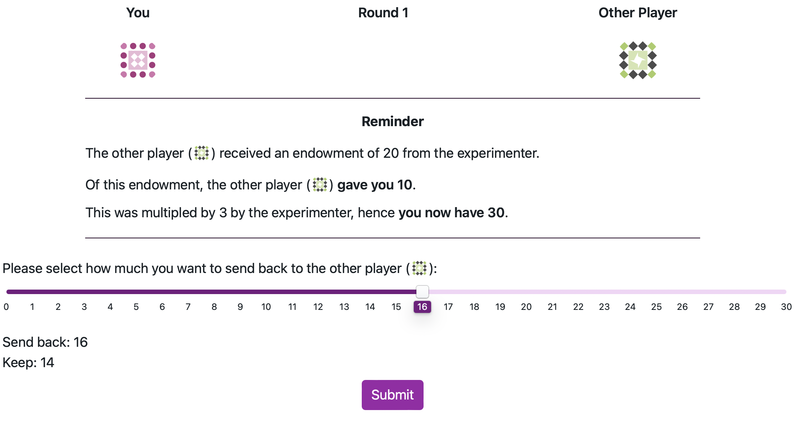

```{r setupCoaxsupp, include=FALSE}
knitr::opts_chunk$set(warning = FALSE, message = FALSE, echo = FALSE) 
knitr::opts_chunk$set(out.width = "\\textwidth")
library(papaja)
library(kableExtra)
library(knitr)

# using some functions dplyr, ggpubr, PairedData and sjPlot. Need to be loaded. 
library(tidyverse)
library(afex)
library(PairedData)
library(multcompView)
library(lsmeans)
library(depmixS4)
library(flextable)
library(gridExtra)
library(forcats)
library(ggsignif)
```

# A Snapshot of the Repeated Trust Game as Seen by Participants {-}

Figure \@ref(fig:trustGameScreenshot) shows a screenshot of the repeated Trust Game at the moment the participant is required to make a decision of how much to send back to the Investor.

```{r trustGameScreenshot, include=T, fig.cap = "Screenshot of the RTG as seen by participants at the decision phase.", fig.align='center'}



```

# Hidden Markov Model Used to Simulate the Investor's Actions {-}

The HMM assumes that the probability of each investment $I_t=0,…,20$, at each trial t, conditional on the current state of the investor $S_t$, is dependent on an underlying normal distribution with mean $\mu_s$ and standard deviation $\sigma_s$. The probability of each discrete investment was determined from the cumulative normal distribution $\Phi$, computing the probability of a Normal variate falling between the midway points of the response options. As responses were bounded at 0 and 20, we normalized these probabilities further by taking the endpoints into account. For instance, the probability of an investment $I_t=2$ is defined as: 

$$P(I_t=2 | S_t=s)= \frac{\Phi(2.5 | \mu_s,\sigma_s ) - \Phi(1.5 | \mu_s,\sigma_s )} {\Phi(20.5 | \mu_s,\sigma_s ) - \Phi(-0.5 | \mu_s,\sigma_s )}$$

Note that the denominator truncates the distribution between 0 and 20. To estimate the transition probability between states for the investor, a multinomial logistic regression model was fitted to the investor's data such as: 

$$P(S_{t+1} = s' | S_t=s , X_t = x)= \frac{\exp(\beta_{0,s,s'} + \beta_{1,s,s'} x)}{\sum_{s''} \exp(\beta_{0,s,s''} + \beta_{1,s,s''} x)}$$ 

where $X_t=R_t-I_t$ is the net return to the investor with  $R_t$ the amount returned by the trustee and $I_t$ is the Investment sent.

The advantages of this approach is that it does not require any a priori assumptions about the model features. The number of states, the policy conditional on the state, and the transition function between states can all determined in a purely data-driven way. These HMMs can in turn be used to simulate a human-like agent playing the trust game. This agent may transition to a new state depending on the other player's actions and adopt a policy reflecting its state, thus simulating changes in emotional dispositions of human players during a repeated game. When the investor gains from the interaction, they become more likely to transition to a state where their policy is more "trusting" with generally higher investments. However, faced with losses, the investor is more likely to transition to a more cautious policy with generally lower investments. The policies and the transitions between states are sufficient to build an agent that reflects this type of adaptive behavior and reacts to the trustee's action choices in a way that mimics a human player.

We estimated a three-state model for investor's behaviour, using maximum likelihood estimation via the Expectation-Maximisation algorithm as implemented in the depmixS4 package for R [@visser_depmixs4_2021]. The model was estimated using investments from existing datasets of human dyads playing 10 rounds of the RTG with the same trustee. The dataset consisted of a total of 381 games from two data sources: First, a total of 93 repeated trust games with healthy investors and a mix of healthy trustees and trustees diagnosed with Borderline Personality Disorder (BPD) [@king-casas_rupture_2008]. The second source was from data collected as part of a project investigating social exchanges in BPD and antisocial personality disorder reported on elsewhere [@euler_interpersonal_2021; @huang_multidirectional_2020; @rifkin-zybutz_impaired_2021] and consists of 288 games. In both datasets, the investor on which we modelled the HMM's strategy was always selected from a healthy population and the trustees were a mix of healthy participants and those with personality disorders allowing for a diversified interaction behavior. 

 
# Mixed-effects Models for Participant Returns {-}

We fit a linear mixed-effects model to participant returns as a proportion of the multiplied investment received. The model specification is described below, and the results are presented in Table \@ref(tab:myTableRet).

\[
\begin{split}
\text{ReturnPercentage}_{ij} = & \, \beta_0 + \beta_1 \text{Opponent}_i + \beta_2 \text{Investment}_i + \beta_3 \text{D-level}_i + \beta_4 \text{Order}_i + \beta_5 \text{Round}_i + \\
& [\text{All interaction terms}] + \\
& b_{0j} + b_{1j} \text{Opponent}_i + b_{2j} \text{Investment}_i + \epsilon_{ij}
\end{split}
\]

where:

- \( \text{ReturnPercentage}_{ij} \): The percentage of the tripled investment returned by participant \( j \) on trial \( i \).
- The **Fixed Effects** are:
    - \( \beta_0 \): The overall intercept.
    - \( \beta_1 \) to \( \beta_5 \): The main effects for Opponent Type (\(\text{Opponent}_i\)), scaled Investment (\(\text{Investment}_i\)), D-Factor level (\(\text{D-level}_i\)), presentation order (\(\text{Order}_i\)), and round number (\(\text{Round}_i\)).
    - The model includes all possible two-way, three-way, four-way, and five-way interaction terms among the five fixed effects, represented by \([\text{All interaction terms}]\).
- The **Random Effects** account for by-participant variability:
    - \( b_{0j} \): A random intercept for each participant \( j \).
    - \( b_{1j} \): A random slope for the effect of Opponent Type for each participant \( j \).
    - \( b_{2j} \): A random slope for the effect of Investment for each participant \( j \).
- \( \epsilon_{ij} \): The residual error term for participant \( j \) on trial \( i \).


```{r, include=F}


# # Create a summary object
# model_summary <- readRDS("data/mod_returns_pct_RS.RDS")
# 
# 
# # Extract the fixed effects as a data frame
# mod_df <- as.data.frame(model_summary$coefficients)
# 
# 
# mod_df <- mod_df %>%
#   rownames_to_column(var = "Term") %>% 
#   mutate(Term = gsub("condition.f1", "Condition", Term),
#          Term = gsub("phase.f1", "Phase", Term),
#          Term = gsub("high_RS1", "RS_group", Term),
#          Term = gsub("inv_scaled", "Investment", Term)) %>%
#   mutate(across(where(is.numeric), ~round(., 2)))  # Round all numeric columns to 2 decimal places


```


```{r myTableRet, results='asis'}
# # Create table using kable and kableExtra
# kable(mod_df, 
#       caption = "Summary of Mixed-Effects Model of participant returns across all rounds",
#       booktabs = TRUE,
#       align = c("l", "c", "c", "c", "c", "c")) %>%
#   kable_styling(latex_options = c("striped", "hold_position"))
```


```{r}

# Retrieve the model object from the file
model_object <- readRDS("data/mod_return_pct.RDS")

# Get the summary containing the coefficient table
model_summary <- summary(model_object)

# Extract the fixed effects coefficients into a data frame
mod_df <- as.data.frame(model_summary$coefficients)

# Load required packages for data manipulation
library(dplyr)
library(tibble)

# Clean up the data frame for presentation
mod_df <- mod_df %>%
  rownames_to_column(var = "Term") %>%
  # Rename the predictor terms for readability
  mutate(
    Term = gsub("d_level1", "D-Level", Term), # Corrected this line
    Term = gsub("opponent\\.f1", "Opponent", Term),
    Term = gsub("volatile_firstTRUE", "Order", Term),
    Term = gsub("inv_scaled", "Investment", Term),
    Term = gsub("roundNum", "Round", Term),
    # Make interaction terms more readable
    Term = gsub(":", " x ", Term)
  ) %>%
  # Add a column for significance stars using the correct p-value column name
  mutate(
    Signif = case_when(
      `Pr(>|t|)` < 0.001 ~ "***",
      `Pr(>|t|)` < 0.01  ~ "**",
      `Pr(>|t|)` < 0.05  ~ "*",
      TRUE              ~ ""
    )
  ) %>%
  # Rename the p-value column for cleaner output
  rename("p-value" = `Pr(>|t|)`) %>%
  # Round all numeric columns to 3 decimal places for reporting
  # This is done last to ensure the case_when works with the original values
  mutate(across(where(is.numeric), ~round(., 3)))
```


```{r}
# Load required packages for table creation
library(knitr)
library(kableExtra)

# Create table using kable and kableExtra
kable(mod_df,
      caption = "Full Results of the Linear Mixed-Effects Model of Participant Percentage Returns.",
      booktabs = TRUE,
      # Set column names, with an empty name for the significance column
      col.names = c("Term", "Estimate", "Std. Error", "df", "t-value", "p-value", ""),
      align = c("l", "r", "r", "r", "r", "r", "l")) %>%
  # Use add_footnote() for better compatibility
  add_footnote(label = "Significance codes: * p < 0.05, ** p < 0.01, *** p < 0.001",
               notation = "none") %>%
  kable_styling(latex_options = c("striped", "hold_position", "scale_down"))

```


# Mixed effects models for opponent ratings 

We fit linear mixed-effects models to participants' ratings of their opponents (cooperativeness, willingness to play again, and trustworthiness). The model specification for the cooperative ratings is described below as an example; identical model structures were used for the other ratings. The results of the models are presented in Section 3.5 of the main text.

\[
\begin{split}
\text{CooperativeRating}_{ij} = & \, \beta_0 + \beta_1 \text{D-level}_i + \beta_2 \text{Order}_i + \beta_3 \text{Opponent}_i + \\
& [\text{Interaction terms}] + \\
& b_{0j} + \epsilon_{ij}
\end{split}
\]

where:

- \( \text{CooperativeRating}_{ij} \): The cooperativeness rating given by participant \( j \) for opponent \( i \).
- The **Fixed Effects** are:
    - \( \beta_0 \): The overall intercept.
    - \( \beta_1 \) to \( \beta_3 \): The main effects for D-Factor level (\(\text{D-level}_i\)), game order (\(\text{Order}_i\)), and Opponent Type (\(\text{Opponent}_i\)).
    - The model includes all two-way and three-way interaction terms among the three fixed effects, represented by \([\text{Interaction terms}]\).
- The **Random Effects** account for by-participant variability:
    - \( b_{0j} \): A random intercept for each participant \( j \).
- \( \epsilon_{ij} \): The residual error term for participant \( j \)'s rating of opponent \( i \).
\pagebreak


# References {-}