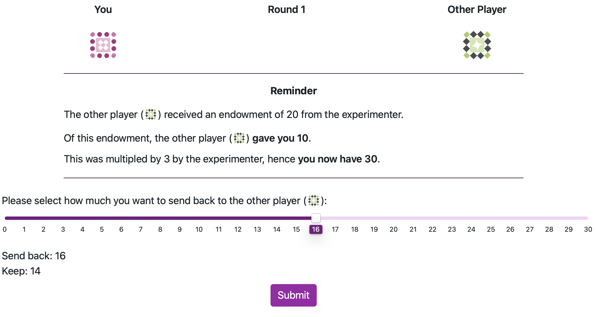

```{r setupCoaxsupp, include=FALSE}
knitr::opts_chunk$set(warning = FALSE, message = FALSE, echo = FALSE) 
knitr::opts_chunk$set(out.width = "\\textwidth")
library(papaja)
library(kableExtra)
library(knitr)

# using some functions dplyr, ggpubr, PairedData and sjPlot. Need to be loaded. 
library(tidyverse)
library(afex)
library(PairedData)
library(multcompView)
library(lsmeans)
library(depmixS4)
library(flextable)
library(gridExtra)
library(forcats)
library(ggsignif)
```

# A Snapshot of the Repeated Trust Game as Seen by Participants {-}

Figure \@ref(fig:trustGameScreenshot) shows a screenshot of the repeated Trust Game at the moment the participant is required to make a decision of how much to send back to the Investor.

```{r trustGameScreenshot, include=T, fig.cap = "Screenshot of the RTG as seen by participants at the decision phase.", fig.align='center'}



```

# Hidden Markov Model Used to Simulate the Investor's Actions {-}

The HMM assumes that the probability of each investment $I_t=0,…,20$, at each trial t, conditional on the current state of the investor $S_t$, is dependent on an underlying normal distribution with mean $\mu_s$ and standard deviation $\sigma_s$. The probability of each discrete investment was determined from the cumulative normal distribution $\Phi$, computing the probability of a Normal variate falling between the midway points of the response options. As responses were bounded at 0 and 20, we normalized these probabilities further by taking the endpoints into account. For instance, the probability of an investment $I_t=2$ is defined as: 

$$P(I_t=2 | S_t=s)= \frac{\Phi(2.5 | \mu_s,\sigma_s ) - \Phi(1.5 | \mu_s,\sigma_s )} {\Phi(20.5 | \mu_s,\sigma_s ) - \Phi(-0.5 | \mu_s,\sigma_s )}$$

Note that the denominator truncates the distribution between 0 and 20. To estimate the transition probability between states for the investor, a multinomial logistic regression model was fitted to the investor's data such as: 

$$P(S_{t+1} = s' | S_t=s , X_t = x)= \frac{\exp(\beta_{0,s,s'} + \beta_{1,s,s'} x)}{\sum_{s''} \exp(\beta_{0,s,s''} + \beta_{1,s,s''} x)}$$ 

where $X_t=R_t-I_t$ is the net return to the investor with  $R_t$ the amount returned by the trustee and $I_t$ is the Investment sent.

The advantages of this approach is that it does not require any a priori assumptions about the model features. The number of states, the policy conditional on the state, and the transition function between states can all determined in a purely data-driven way. These HMMs can in turn be used to simulate a human-like agent playing the trust game. This agent may transition to a new state depending on the other player's actions and adopt a policy reflecting its state, thus simulating changes in emotional dispositions of human players during a repeated game. When the investor gains from the interaction, they become more likely to transition to a state where their policy is more "trusting" with generally higher investments. However, faced with losses, the investor is more likely to transition to a more cautious policy with generally lower investments. The policies and the transitions between states are sufficient to build an agent that reflects this type of adaptive behavior and reacts to the trustee's action choices in a way that mimics a human player.

We estimated a three-state model for investor's behaviour, using maximum likelihood estimation via the Expectation-Maximisation algorithm as implemented in the depmixS4 package for R [@visser_depmixs4_2021]. The model was estimated using investments from existing datasets of human dyads playing 10 rounds of the RTG with the same trustee. The dataset consisted of a total of 381 games from two data sources: First, a total of 93 repeated trust games with healthy investors and a mix of healthy trustees and trustees diagnosed with Borderline Personality Disorder (BPD) [@king-casas_rupture_2008]. The second source was from data collected as part of a project investigating social exchanges in BPD and antisocial personality disorder reported on elsewhere [@euler_interpersonal_2021; @huang_multidirectional_2020; @rifkin-zybutz_impaired_2021] and consists of 288 games. In both datasets, the investor on which we modelled the HMM's strategy was always selected from a healthy population and the trustees were a mix of healthy participants and those with personality disorders allowing for a diversified interaction behavior. 

 
# Mixed-effects Models for Participant Returns {-}

We fit a linear mixed-effects model to participant returns as a proportion of the multiplied investment received. The model specification is described below, and the results are presented in Table \@ref(tab:myTableRet).

\[
\begin{split}
\text{ReturnPercentage}_{ij} = & \, \beta_0 + \beta_1 \text{Opponent}_i + \beta_2 \text{Investment}_i + \beta_3 \text{D-level}_i + \beta_4 \text{Order}_i + \beta_5 \text{Round}_i + \\
& [\text{All interaction terms}] + \\
& b_{0j} + b_{1j} \text{Opponent}_i + b_{2j} \text{Investment}_i + \epsilon_{ij}
\end{split}
\]

where:

- \( \text{ReturnPercentage}_{ij} \): The percentage of the tripled investment returned by participant \( j \) on trial \( i \).
- The **Fixed Effects** are:
    - \( \beta_0 \): The overall intercept.
    - \( \beta_1 \) to \( \beta_5 \): The main effects for Opponent Type (\(\text{Opponent}_i\)), scaled Investment (\(\text{Investment}_i\)), D-Factor level (\(\text{D-level}_i\)), presentation order (\(\text{Order}_i\)), and round number (\(\text{Round}_i\)).
    - The model includes all possible two-way, three-way, four-way, and five-way interaction terms among the five fixed effects, represented by \([\text{All interaction terms}]\).
- The **Random Effects** account for by-participant variability:
    - \( b_{0j} \): A random intercept for each participant \( j \).
    - \( b_{1j} \): A random slope for the effect of Opponent Type for each participant \( j \).
    - \( b_{2j} \): A random slope for the effect of Investment for each participant \( j \).
- \( \epsilon_{ij} \): The residual error term for participant \( j \) on trial \( i \).


```{r, include=F}


# # Create a summary object
# model_summary <- readRDS("data/mod_returns_pct_RS.RDS")
# 
# 
# # Extract the fixed effects as a data frame
# mod_df <- as.data.frame(model_summary$coefficients)
# 
# 
# mod_df <- mod_df %>%
#   rownames_to_column(var = "Term") %>% 
#   mutate(Term = gsub("condition.f1", "Condition", Term),
#          Term = gsub("phase.f1", "Phase", Term),
#          Term = gsub("high_RS1", "RS_group", Term),
#          Term = gsub("inv_scaled", "Investment", Term)) %>%
#   mutate(across(where(is.numeric), ~round(., 2)))  # Round all numeric columns to 2 decimal places


```


```{r, results='asis'}
# # Create table using kable and kableExtra
# kable(mod_df, 
#       caption = "Summary of Mixed-Effects Model of participant returns across all rounds",
#       booktabs = TRUE,
#       align = c("l", "c", "c", "c", "c", "c")) %>%
#   kable_styling(latex_options = c("striped", "hold_position"))
```


```{r}

# Retrieve the model object from the file
model_object <- readRDS("data/mod_return_pct.RDS")

# Get the summary containing the coefficient table
model_summary <- summary(model_object)

# Extract the fixed effects coefficients into a data frame
mod_df <- as.data.frame(model_summary$coefficients)

# Load required packages for data manipulation
library(dplyr)
library(tibble)

# Clean up the data frame for presentation
mod_df <- mod_df %>%
  rownames_to_column(var = "Term") %>%
  # Rename the predictor terms for readability
  mutate(
    Term = gsub("d_level1", "D-Level", Term), # Corrected this line
    Term = gsub("opponent\\.f1", "Opponent", Term),
    Term = gsub("volatile_firstTRUE", "Order", Term),
    Term = gsub("inv_scaled", "Investment", Term),
    Term = gsub("roundNum", "Round", Term),
    # Make interaction terms more readable
    Term = gsub(":", " x ", Term)
  ) %>%
  # Add a column for significance stars using the correct p-value column name
  mutate(
    Signif = case_when(
      `Pr(>|t|)` < 0.001 ~ "***",
      `Pr(>|t|)` < 0.01  ~ "**",
      `Pr(>|t|)` < 0.05  ~ "*",
      TRUE              ~ ""
    )
  ) %>%
  # Rename the p-value column for cleaner output
  rename("p-value" = `Pr(>|t|)`) %>%
  # Round all numeric columns to 3 decimal places for reporting
  # This is done last to ensure the case_when works with the original values
  mutate(across(where(is.numeric), ~round(., 3)))
```


```{r myTableRet}
# Load required packages for table creation
library(knitr)
library(kableExtra)

# Create table using kable and kableExtra
kable(mod_df,
      caption = "Full Results of the Linear Mixed-Effects Model of Participant Percentage Returns.",
      booktabs = TRUE,
      # Set column names, with an empty name for the significance column
      col.names = c("Term", "Estimate", "Std. Error", "df", "t-value", "p-value", ""),
      align = c("l", "r", "r", "r", "r", "r", "l")) %>%
  # Use add_footnote() for better compatibility
  add_footnote(label = "Significance codes: * p < 0.05, ** p < 0.01, *** p < 0.001",
               notation = "none") %>%
  kable_styling(latex_options = c("striped", "hold_position", "scale_down"))

```


# Mixed Effects Models for Opponent Ratings {-}

We fit linear mixed-effects models to participants' ratings of their opponents (cooperativeness, willingness to play again, and trustworthiness). The model specification for the cooperative ratings is described below as an example; identical model structures were used for the other ratings.

\[
\begin{split}
\text{CooperativeRating}_{ij} = & \, \beta_0 + \beta_1 \text{D-level}_i + \beta_2 \text{Order}_i + \beta_3 \text{Opponent}_i + \\
& [\text{Interaction terms}] + \\
& b_{0j} + \epsilon_{ij}
\end{split}
\]

where:

- \( \text{CooperativeRating}_{ij} \): The cooperativeness rating given by participant \( j \) for opponent \( i \).
- The **Fixed Effects** are:
    - \( \beta_0 \): The overall intercept.
    - \( \beta_1 \) to \( \beta_3 \): The main effects for D-Factor level (\(\text{D-level}_i\)), game order (\(\text{Order}_i\)), and Opponent Type (\(\text{Opponent}_i\)).
    - The model includes all two-way and three-way interaction terms among the three fixed effects, represented by \([\text{Interaction terms}]\).
- The **Random Effects** account for by-participant variability:
    - \( b_{0j} \): A random intercept for each participant \( j \).
- \( \epsilon_{ij} \): The residual error term for participant \( j \)'s rating of opponent \( i \).

## Detailed Results {-}

### Cooperative Ratings {-}

Linear mixed-effects analysis revealed a significant main effect of D-level, $F(1, 179) = 7.35$, $p = .007$, with Low-D participants rating their opponents as more cooperative than High-D participants.
A significant main effect of game order, $F(1, 179) = 10.67$, $p = .001$, indicated participants rated opponents in their first game as more cooperative than those in their second game.
Additionally, there was a significant main effect of opponent type, $F(1, 179) = 5.31$, $p = .022$, with Human-like HMM opponents receiving higher cooperative ratings than Responsive opponents.
No significant interactions were observed (all $p$s > .29).

### Play Again Ratings {-}

Analysis of participants' willingness to play with the same opponent again revealed a significant main effect of game order, $F(1, 179) = 13.83$, $p < .001$, with participants generally more willing to play again with opponents from their first game.
This main effect was qualified by a significant D-level × Game Order interaction, $F(1, 179) = 4.05$, $p = .046$.

Post-hoc analyses revealed that in the first game, High-D participants were significantly less willing to play again with their opponents compared to Low-D participants ($M_{diff} = -1.07$, $t(320) = -2.37$, $p = .018$), while no such difference existed in the second game ($M_{diff} = -0.03$, $t(320) = -0.07$, $p = .947$).
Examining changes across games, Low-D participants showed a significant decrease in willingness to play again from the first to the second game ($M_{diff} = 1.48$, $t(179) = 4.05$, $p < .001$), while High-D participants maintained consistent ratings across games ($M_{diff} = 0.44$, $t(179) = 1.21$, $p = .229$).

### Trusting Ratings {-}

For trust ratings, significant main effects were observed for D-level, $F(1, 179) = 7.53$, $p = .007$; game order, $F(1, 179) = 7.21$, $p = .008$; and opponent type, $F(1, 179) = 4.62$, $p = .033$.
These effects were qualified by a significant three-way interaction between D-level, game order, and opponent type, $F(1, 179) = 4.76$, $p = .030$.

Post-hoc analyses revealed a complex pattern of trust perceptions.
High-D participants rated Human-like opponents as significantly less trusting than Low-D participants in the first game ($M_{diff} = -1.65$, $t(315) = -2.96$, $p = .003$).
In contrast, High-D participants rated Responsive opponents as significantly less trusting than Low-D participants in the second game ($M_{diff} = -1.51$, $t(315) = -2.70$, $p = .007$).
Low-D participants showed a significant *increase* in trust ratings for Human-like opponents from the first to the second game ($M_{diff} = 1.22$, $t(315) = 2.22$, $p = .027$), while High-D participants showed a significant *decrease* in trust ratings for Responsive opponents from the first to the second game ($M_{diff} = 1.35$, $t(315) = 2.47$, $p = .014$).
Additionally, High-D participants in the second game differentiated between opponent types, rating Human-like opponents as significantly more trusting than Responsive opponents ($M_{diff} = 1.37$, $t(315) = 2.51$, $p = .013$).

### Summary {-}

Participants with higher Dark Factor scores demonstrated consistently more negative perceptions of their opponents, particularly regarding cooperation and trust.
The pattern of results indicates that individual differences in Dark Factor traits influence not only the overall level of opponent ratings but also how these ratings change across repeated interactions and between different opponent types.
Notably, Low-D participants showed greater sensitivity to game order, with more pronounced decreases in ratings from first to second game, while High-D participants demonstrated greater discrimination between opponent types in their trust ratings.

\pagebreak


# Sensitivity Analysis: Excluding Participants Who Believed They Played a Computer {-}

To address concerns about the ecological validity of our findings given that some participants suspected they were playing against a computer rather than a human, we conducted a sensitivity analysis restricting the sample to participants who either believed they were playing against a human or were unsure. This approach excludes only those participants who were certain they played against a computer (N = 79, 43.2%), retaining participants who believed "Human" (N = 47, 25.7%) or indicated "Not Sure" (N = 57, 31.1%), for a total of 104 participants (56.8% of the original sample).

We re-estimated our primary mixed-effects model on this restricted sample using the same specification as the full analysis.

```{r sensitivity-setup, include=FALSE}
# Load the main data
final_data <- read.csv("data/anonymized_final_data.csv")

# Apply same transformations as main analysis
final_data <- final_data %>%
  mutate(ret_pct_na = ifelse(investment == 0, NA, return / (3 * investment)),
         opponent.f = factor(gameOpponent, levels = c("AI_HMM", "AI_HMM_vol")),
         d_level = as.factor(d_level),
         roundNum = as.numeric(as.character(roundNum)),
         inv_scaled = as.vector(scale(investment)))

# Remove last round (endgame effects)
data24 <- final_data %>% filter(roundNum < 25)

# Filter to exclude only those certain it was a computer
data24_believed <- data24 %>%
  filter(Turing.choice %in% c("Human", "Not Sure"))

# Verify sample size
n_believed <- length(unique(data24_believed$playerId))
```

```{r sensitivity-model, include=FALSE, cache=TRUE}
# Run sensitivity model with same specification as main analysis
mod_return_pct_sensitivity <- afex::mixed(
  ret_pct_na ~ opponent.f * inv_scaled * d_level * volatile_first * roundNum +
    (1 + opponent.f + inv_scaled | playerId),
  data = data24_believed,
  REML = TRUE,
  method = "KR",
  control = lmerControl(optimizer = "bobyqa", optCtrl = list(maxfun = 100000))
)

# Save for potential reuse
saveRDS(mod_return_pct_sensitivity, "data/mod_return_pct_sensitivity.RDS")
```

```{r sensitivity-results, include=FALSE}
# Get model summary
sens_summary <- summary(mod_return_pct_sensitivity)

# Extract coefficients
sens_coef <- as.data.frame(sens_summary$coefficients)

# Clean up for presentation
sens_df <- sens_coef %>%
  rownames_to_column(var = "Term") %>%
  mutate(
    Term = gsub("d_level1", "D-Level", Term),
    Term = gsub("opponent\\.f1", "Opponent", Term),
    Term = gsub("volatile_firstTRUE", "Order", Term),
    Term = gsub("inv_scaled", "Investment", Term),
    Term = gsub("roundNum", "Round", Term),
    Term = gsub(":", " x ", Term)
  ) %>%
  mutate(
    Signif = case_when(
      `Pr(>|t|)` < 0.001 ~ "***",
      `Pr(>|t|)` < 0.01  ~ "**",
      `Pr(>|t|)` < 0.05  ~ "*",
      TRUE              ~ ""
    )
  ) %>%
  rename("p-value" = `Pr(>|t|)`) %>%
  mutate(across(where(is.numeric), ~round(., 3)))

# Extract key effects for comparison
d_main <- sens_df %>% filter(Term == "D-Level")
d_opp <- sens_df %>% filter(Term == "Opponent x D-Level")
d_opp_inv <- sens_df %>% filter(Term == "Opponent x Investment x D-Level")
```

```{r sensitivity-table}
# Create table
kable(sens_df,
      caption = "Sensitivity Analysis: Mixed-Effects Model Results for Participants Who Believed Human or Were Unsure (N = 104).",
      booktabs = TRUE,
      col.names = c("Term", "Estimate", "Std. Error", "df", "t-value", "p-value", ""),
      align = c("l", "r", "r", "r", "r", "r", "l")) %>%
  add_footnote(label = "Significance codes: * p < 0.05, ** p < 0.01, *** p < 0.001",
               notation = "none") %>%
  kable_styling(latex_options = c("striped", "hold_position", "scale_down"))
```

The sensitivity analysis reveals that the key patterns observed in the full sample remain consistent in this restricted sample. Specifically, the D-Level × Opponent × Investment interaction—our primary finding demonstrating that high-D individuals show differential exploitation patterns depending on opponent type—shows the same direction of effect (`r ifelse(d_opp_inv$Estimate > 0, "positive", "negative")` estimate: $\beta$ = `r d_opp_inv$Estimate`, $t$ = `r d_opp_inv$"t value"`, $p$ `r ifelse(d_opp_inv$"p-value" < 0.001, "< .001", paste0("= ", sprintf("%.3f", d_opp_inv$"p-value")))`). While reduced statistical power from the smaller sample affects significance levels for some effects, the overall pattern of results supports our conclusions that the observed D-factor effects are not artifacts of participants' beliefs about their opponents.

\pagebreak


# References {-}